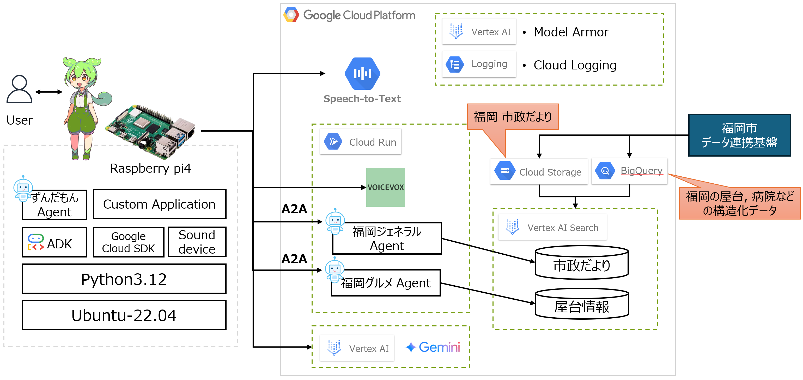

# zundamon-voice-chat
ずんだもんとおしゃべりするチャットボットのリポジトリ。<br>

## 概要
ラズパイ側は重い処理はせず、各機能は外部サービスが担う。<br>
なお、ラズパイからGoogle Cloudへはサービスアカウントを使用することでセキュリティを担保する。
- 文字起こし<br>
　Google CloudのSpeech-to-Textを使用してリアルタイム文字起こしをする。
- LLM<br>
　gemini-2.5-flashを使用する。<br>
- 音声合成<br>
　VOICEVOXでずんだもんの音声を合成する。VOICEVOXが提供するDockerイメージを使用する。
- RAG<br>
　Google Cloud StorageおよびBigQueryに福岡市のデータ基盤情報を連携する。<br>
　それらの情報をVertex AI SearchおよびAIエージェントを使いRAGを実装する。

## プロジェクト構成
- ### 全体アーキテクチャ


- ### フォルダ構成
```
hackathon-2025-zundamon-voice-chatbot
├── a2a_agents                    # Cloud Runにデプロイするリモートのエージェント（ずんだもんエージェントとA2Aで通信）
│   ├── fukuoka_dayori_agent      # 福岡市の市政だよりをもとに質問に回答するエージェント
│   └── yatai_agent               # 福岡市の屋台データベースをもとに質問に回答するエージェント
├── module                        # 各単機能の動作確認用スクリプト
│   ├── realtime_transcription.py # ADKで実装したシンプルなエージェント
│   ├── speech_synthesis.py       # リアルタイム文字起こし
│   └── zunda_agent.py            # 音声合成とローカルLLM
├── .env                          # 環境変数
├── main.py                       # メインの実行スクリプト
├── requirements.txt              # Project dependencies
└── README.md                     # Project documentation
```

## 環境設定（エッジ側）
動作環境はRaspberrypi4（Ubuntu22.04）とする。WSL2上でも動作確認済み。<br>
Pythonバージョンは3.12。<br>

1. **リポジトリのクローン**
   ```sh
   git clone https://github.com/konishi-junichi/hackathon-2025-zundamon-voice-chatbot.git
   cd hackathon-2025-zundamon-voice-chatbot
   ```

2. **Pythonの仮想環境作成**
   ```sh
   python3.12 -m venv venv
   ```

3. **Python仮想環境の起動**
   - On Windows:
     ```sh
     venv\Scripts\activate
     ```
   - On macOS/Linux:
     ```sh
     source venv/bin/activate
     ```

4. **Pythonライブラリのインストール**
   ```sh
   python -m pip install -r requirements.txt
   ```

5. **エージェントアプリ実行**
   以下のコマンドでアプリ実行。
   ```sh
   python main.py
   ```

## 環境設定（Google Cloud側）
1. **事前設定**<br>
   本プロジェクトに必要なGoogle CloudサービスのAPIを有効化してください。
   - Discovery Engine API
   - Cloud Speech-to-Text API
   - Vertex AI API
   - Model Armor API

2. **データストアの作成**<br>
   構造化データはBigQueryへ、非構造化データはGoogle Cloud Storageへ格納してください。
   その後、Vertex AI Searchサービスからデータストアを作成してください。（詳細説明は省略）

3. **各種インストールと動作確認**<br>
   Google CloudのCloud RunにVOICEVOXサーバを構築するコマンド
   ```sh
   gcloud run deploy voicevox-server \
      --image=voicevox/voicevox_engine:cpu-ubuntu20.04-latest \
      --region=asia-northeast1 \
      --port=50021 \
      --memory=16Gi \
      --no-allow-unauthenticated \
      --platform=managed
   ```

4. **Cloud Runへのエージェントデプロイ**<br>
   a2a_agentsディレクトリにある各README.mdに従ってデプロイする。

## 参考URL
[ADK Python 公式ドキュメント](https://google.github.io/adk-docs/)<br>
[Google Cloud Speech-to-Text 公式ドキュメント](https://cloud.google.com/speech-to-text/docs/transcribe-streaming-audio?hl=ja#perform_streaming_speech_recognition_on_an_audio_stream)<br>
[VoiceVOX音声合成のDocker](https://github.com/VOICEVOX/voicevox_engine#docker-%E3%82%A4%E3%83%A1%E3%83%BC%E3%82%B8)<br>
